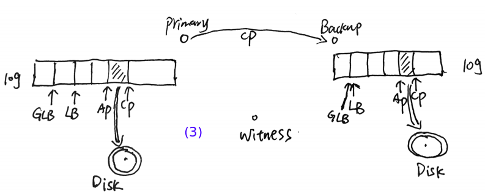

1. 什么是"primary copy replication"?

   多个server中有一个是primary, 其余都是backup. 这一组server用于存储file的副本. 客户端首先和primary通信,然后primary和其余的backup通信.

  可参考文献:

 [1] Viewstamped Replication: A New Primary Copy Method to Support Highly-Available Distributed Systems.

2. "replication"可以提高可用性("availability")和响应时间("response time")

  可用性是指在server失败时,用户仍然可以访问server. 复制技术保存多个备份,可以容忍失败.复制技术可以让用户尽快访问到你自己最近的数据.

  加快响应时间的同时,也需要想办法保证数据的一致性.

  Coda和Locus两个文件系统使用复制技术来提高可用性,同时加快响应时间,  当他们没有很好的解决一致性问题

3. Harp 使用replicaiton只是用于提高可用性和可靠性

4. 什么是"partition"? 分布式系统中经常会遇到partition的问题.

  来自wikipedia的[解释](http://en.wikipedia.org/wiki/Network_partition):

  A network partition refers to the failure of a network device that causes a network to be split.

  For example, in a network with multiple subnets where nodes A and B are located in one subnet and nodes C and D are in another, a partition occurs if the switch between the two subnets fails. In that case nodes A and B can no longer communicate with nodes C and D.

  Some systems are partition-tolerant. This means that even after they are partitioned into multiple sub-systems, they work the same as before.

  [mongodb network partition]  (http://blog.mongodb.org/post/505822180/on-distributed-consistency-part-3-network)

  [errors in DB](http://cacm.acm.org/blogs/blog-cacm/83396-errors-in-database-systems-eventual-consistency-and-the-cap-theorem/fulltext)

5. 什么是Write-ahead log?

  Bernstein, P. A., Hadzilacos, V., and Goodman, N..
Concurrency Control and Recovery in Database Systems.
Addison Wesley, 1987. (值得一看)

6. unix fsck?

   The system utility fsck (for "file system consistency check") is a tool for checking the consistency of a file system in Unix and Unix-like operating systems, such as Linux and Mac OS X.[1] (Wikipedia)

7. fail-stop procesors?

   A fail-stop processor never performs an erroneous state transformation due to a failuer. Instead, the processor halts and its state is irretrievably lost. The contents of stable storage are unaffected by any failure. 
    
8. clock synchronized? 

   Clock synchronization is a problem from computer science and engineering which deals with the idea that internal clocks of several computers may differ. Even when initially set accurately, real clocks will differ after some amount of time due to clock drift, caused by clocks counting time at slightly different rates. (Wikipedia)

9. View change algorithms

  参考: [Maintaining Availability in Partitioned Replicated Databases](http://www.cs.rice.edu/~alc/old/comp520/papers/Avail-Databases.pdf)

10. Harp是如何工作的?

  Harp使用2n+1个servers来容忍n个servers同时失效,以此持续地向用户提供服务. 为什么是2n+1? 我想是因为要保证在n个server失效的时候还能做到大多数的(majority)的server能够达成一致性地意见.

  但是Harp只存储n+1个副本,Harp认为这样就可以保证n个server失效的话,信息不会丢失. 另外n个server不存储副本,但是要参与view change算法, 确保只有一个新的view被选中,即使是有network partition的情况下. 这些额外的n个server被叫做witness. 这种说法来自[Voting With Witnesses: A Consistency
Scheme for Replicated Files](http://www2.cs.uh.edu/~paris/MYPAPERS/Icdcs86.pdf)

  Primary和backup都在内存中维持一个log，保存修改操作的事件序列。而且都使用索引变量commit point(CP)来表示在CP之前的事件已经被commit了。

  

  (1) Primary接收到客户端的操作请求后，Primary创建一个事件记录(event record)，将该事件记录append到log中，然后将日志信息发送给backup，backup接收到之后，也将事件记录append到log上。（见上图）

  

  (2) Backup将确认信息发送给Primary,在确认信息中,告知Primary目前backup已经收到索引n之前的所有事件记录.当Primary收到来自backup的告知确认信息后,Primary向前移动CP,提交事件.（见上图）

  

  (3) Primary将CP值发送给backup,backup也维持一个CP,存储着接收到的最大的CP.（见上图）

  被commit的事件记录通过一个单独的进程:apply process来执行.Apply进程使用异步Unix文件系统操作来执行事件记录中的读写操作.Apply进程也维持一个索引指针 AP(Application point),记录着该进程的进度. 由于使用异步文件操作,所以Harp还使用了另外一个进程来追踪Apply进程执行的操作是否结束, 并维持一个索引指针:LB(Lower bound), <=LB的事件记录是全部作用到硬盘上的文件系统上了. 

  backup和primary一样,维持有LB,AP,CP指针,并且Primary和backup互相将自己的LB指针发送给对方.Primary和backup都维持一个GLB(Global LB)指针,GLB是Primary和backup之间最小的LB值, <=GLB的Log项都被删除掉.

11. 当 log大小达到存储空间的上限时怎么办？

  将GLB之前的内存discard掉。

12. Harp是如何对待读文件操作的？
  
  Harp提供了两种方式来配置Harp的读文件操作，第一种：将read视为修改操作，也放入到primary和backup的log中。第二种：完全在Primary执行read操作，此时，read的结果只反应已经commit并且已经执行完的文件操作，read的结果不能反应没有提交的操作。

  如果采用第二种方式的话，可能会造成外部一致性（external consistency）的损失。外部一致性是指：用户期待的操作顺序和系统内部的操作顺序不一致。比如：如果发生network partition的问题，那么backup与witness会形成新的view。此时，如果只在Primary上执行read操作，而新的view上已经发生了write操作，那么Primary上执行read操作就不能反应这个新的view中的write操作，造成不一致。解决的方法是使用loosely synchronized clocks。backup发送给primary的每条message上，都包含一个时间信息t1, t1= backup的时钟时间tc+ts(time slice)。backup向现在的primary承诺，它在 
t1之前不会在new view上执行write操作。Primary在t1之前还是在Primay上执行read操作，一旦Primary的时钟时间大于t1的话，Primary就和Backup进行通信，在new view上执行read 操作。

13. Harp是如何进行view change操作的?

  - 一个view有一个唯一的view number, 每个组成员将当前的view number保存到硬盘上.一个view至少包括:primary, backup。当指定的（designated） primary失败时,designated backup成为primary,witness被提升成为backup。当designated backup失败，witness被提升(promote)为backup。当designated primary恢复或者designated backup恢复, promoted witness被降级(demote)为witness。

  - view change的两种情况：

      - 一个view中的primary 和 backup通过定期联络(heart message)的方式，来检查对方时候还live。witness不参与monitoring。如果对方没有live，那么另外一个发起view change。这种情况又分为：primary fail和backup fail。如果primary fail，那么backup成为view change的协调者(coordinator);如果backup fail, 那么primary成为view change的协调者(coordinator)。这种情况下，witness都会被提升为backup.

      - 第二种情况是在恢复时，view发生变化。当failed primary恢复时，会成为view change的corordinator。或者当failed backup恢复时，会成为view change的corordinator。在这种情况下，witness都会被降级为witness.

  - 第一种情况下的view change,(以backup fail为例)
      
      

      (1)primary检测到backup失败，成为coordinator，向witness询问时候愿意进行view change。witness回复同意形成新的view。（见上图）
 
      

      (2)Primary收到witness的通知后，初始化new view的状态，并将new view的numbver写入到disk上，并将witness结点不知道的new view中的初始化状态发送给witness。因为witness的log为空，而且不参与文件系统的操作，所以，primary需要将log中索引大于GLB的log entry发送给witness。witness收到primary的信息后，将new view number写入到disk，并拥有自己的log，成为backup，参与后续的文件系统的同步。
witness没有文件系统的拷贝，它不能将文件系统的操作提交到文件系统。那么witness是如何以backup的角色执行文件系统操作的呢？ witness有disk或tape，witness将old log entry保存到disk或tape上，向前移动LB指针，以此来模拟执行文件系统操作。witness会一直保存着log中的entry，不会执行discard操作，如果witness中的log大小溢出了，那么需要手动重新配置，或者将与已经删除的文件相关的操作从log中删除。（见上图）

      为减小view change所需的时间，在没有view change发生的情况下，witness接受primary的message（包括append log entry, advance CP），但是witness不回应primary，不执行commit操作。这样，在view change时，primary发送给witness的信息就很小了，加快view change的完成。

  - 第二种情况下的view change, (以backup recover为例)

      

      (1) backup 恢复后，成为new view的coordinator。如果backup的disk没有发生failure，那么backup直接与witness沟通，从witness那里读取log entry，恢复自己没有的log entry。并重新执行log（从失败之前的LB指针处开始执行）。如果backup的disk发生failure，那么backup就先从primary那里获取文件系统的状态，更新恢复自己的文件系统的状态。然后从witness那里读取failure之后产生的log。（见上图）

      

      (2) log同步完成后，发起new view的coordinate。在次之前，primary没有停止运行，仍然与client交互完成文件系统的操作。backup向primary和witness发出new view的请求，primary和promoted witness同意形成new view。 primary停止工作，witness被降级，witness删除log数据,包括disk上和内存上的信息。（见上图）

      
   
      (3) backup收到其他两名成员的回复后，初始化new view的状态，将new view num写入到disk上，并将new view number发送给primary。primary将new view number写入到disk上。然后重新开始运行。（见上图）

  